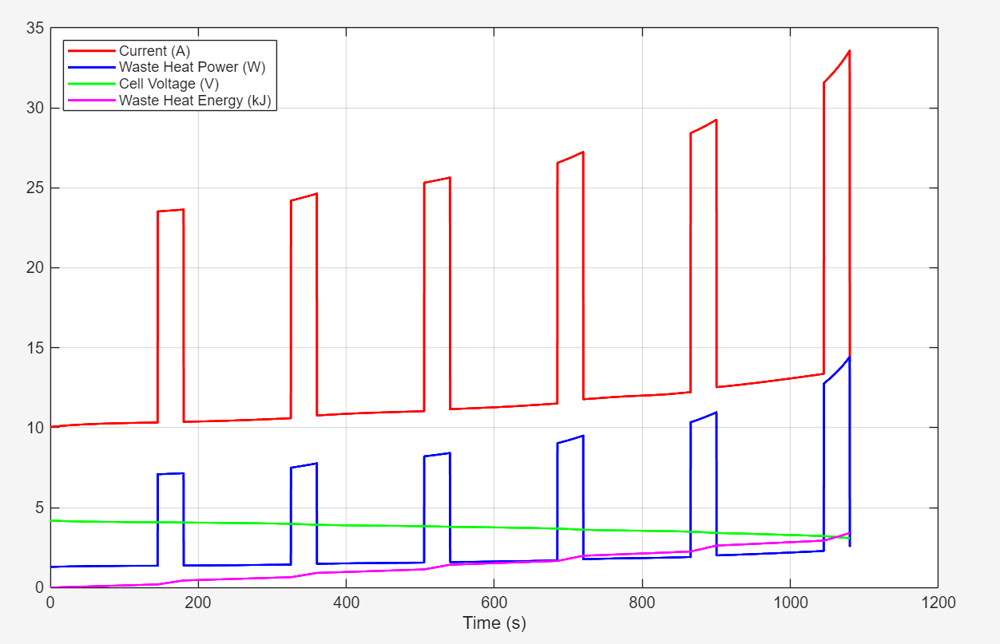
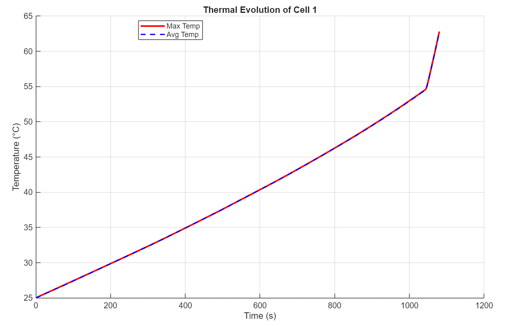

+++

title = 'Battery Pack Coldplate'

image = 'images/thunderbikes.png'

[[relatedblogs]]
title = "Design Process"
url = "blog/my-first-post/"

[[relatedblogs]]
title = 'Testing & Iteration'
url = "blog/my-second-post/"
+++

# OVERVIEW

---

This year I was assigned as the cooling subteam lead on UBC Thunderbikes, and my main task was to evaluate whether active cooling was necessary for the battery packs on our electric racing motorbike.

This was done using MATLAB to create an electro-thermal model of the 21700 cells used on the bike as well as a single-cell thermal FEA analysis using MATLAB's PDE Toolbox to assess temperature rise, 
and ANSYS to do a full battery pack thermal simulation to estimate the thermal load and required coolant flow rate to maintain safe temperature.

# SINGLE-CELL ANALYSIS

---

Each pack contains over 180 cells with a maximum cell temperature of 60°C and diving headfirst into doing full-pack FEA without knowing single-cell performance beforehand would be a waste of time. 
The electro-thermal model and single-cell were all done in MATLAB which lent itself more convenient to use.

**Electro-Thermal model:**

The electro-thermal model used published SOC-OCV data of our cells and constant power draw from our motor spec-sheet to create a time-dependent waste-heat generation profile for a single-cell 
throughout the duration of a race. The model computed current as a function of SOC and updated SOC over time using Coulomb counting, and used the internal resistance of the batteries listed on the 
spec-sheet to generate the profile.

---

  
  

###### Cell profile (left) | Simulation loop diagram (right)

---

The cyclic spikes in heat generation is caused by the power input changing. To simulate the effect of the bike accelerating on the straightaways, within each 180 second lap, the power switches 
from the nominal power rating of 22kW to the maximum 48kW. The model does not account for the change in internal resistance as the battery discharges, but the waste heat profile still provides
a useful starting point for later simulations.

**FEA's with PDE Toolbox:**

Using the waste heat profile generated from the model, a simplified CAD model of the battery, and thermal conductivity and heat capacitance values gathered from literature, I used MATLAB's PDE Toolbox
to do a single-cell thermal FEA to determine whether or not the cells would exceed the 60°C limit without active cooling.

---

  
  

###### FEA result (left) | Time evolution of the cell (right)

---

The cell exceeded 60°C regularly between a variety of initial conditions (20°C - 30°C). This result showed that active cooling may still be required to meet the requirements of the bike, which was
later validated by the ANSYS simulation.

# FULL PACK ANALYSIS 

---