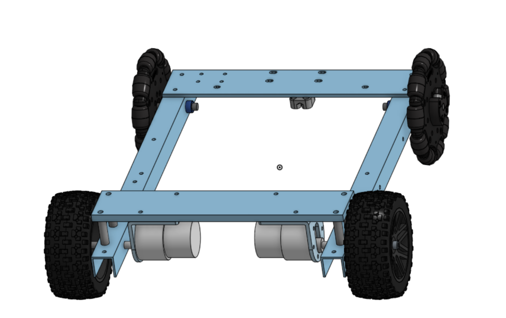
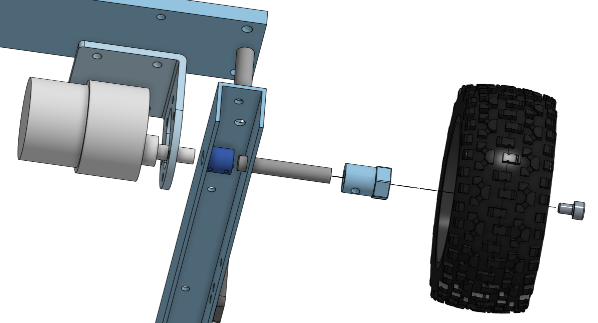
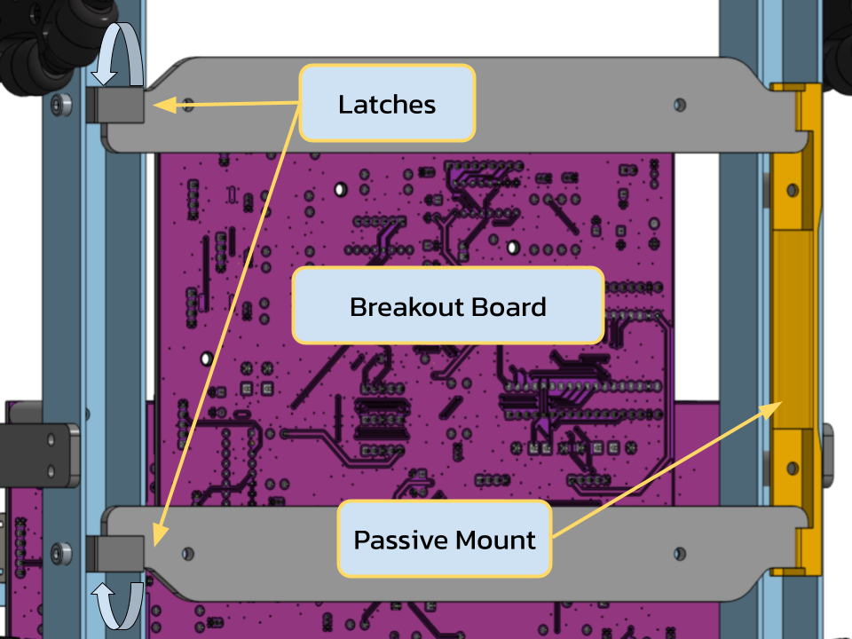
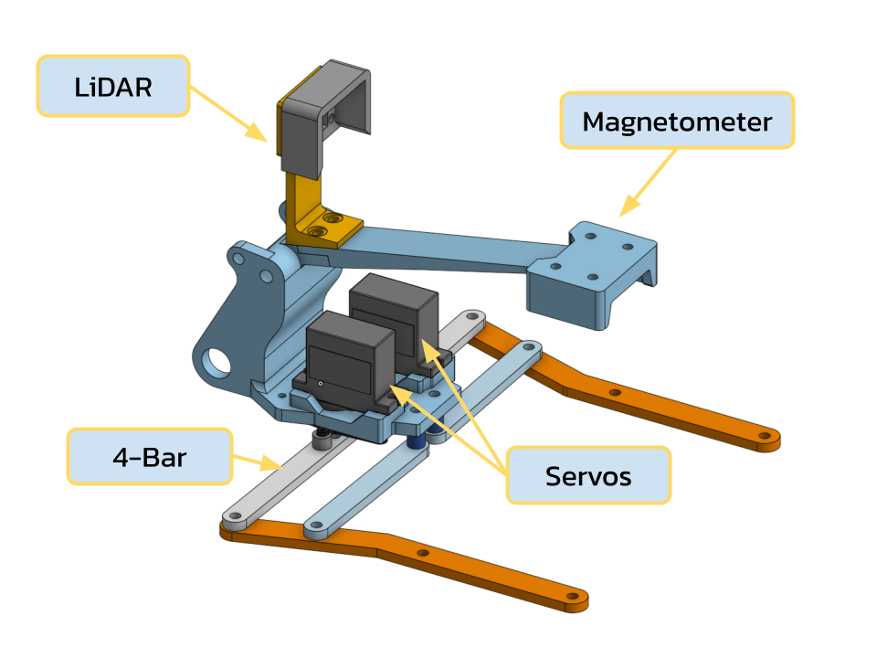

+++
title = "ENPH 253 Robot"
image = "images/ROBOT.jpg"

[[relatedblogs]]
title = "Design Process"
url = "blog/my-first-post/"

[[relatedblogs]]
title = 'Testing & Iteration'
url = "blog/my-second-post/"
+++

This summer I took ENPH 253. In this class we were assembled into teams of 4 and tasked with building a fully autonomous robot to navigate through a course and pick up stuffed animals and return them to our start point.
At the end of the course, each team would compete against eachother to see who could save the most stuffed animals.

---



###### (The finished robot)

---

As part of a 4-man team, I was involved with the mechanical design of the robot. I designed and manufactured the chassis, robot claw, arm mount, and helped design the arm shoulder piece.

We used OnShape to design our robot since it enabled for easy us to collaborate with eachother, and using it we produced all the drawings and STL files required to manufacture the robot.

# THE CHASSIS
---

**Design inputs**

When designing the chassis, we came up with two main design requirements that it had to meet. The chassis needed to be structurally robust enough to withstand frequent crashes during the software
test phase, and it needed to be modular to accomodate the arm, box, and PCB's which did not have their sizes finalized yet. 

The drivetrain would be integrated into the chassis design and consisted of two 76 RPM 2 N&sdot;m DC motors which, at a wheel diameter of 3.5", provided a top speed of 1.3 km/h  — capable of traversing
the course in 9 seconds. To keep the drivetrain simple, the wheels were mounted in a direct-drive configuration thanks to the high torque and reasonable speed provided by the motors. 

---

  
  

###### Bare chassis (left) | Drivetrain assembly (right)

---

**Design solution**

To meet these constraints, I designed an aluminum C-channel chassis (as seen above). The aluminum maximized strength without suffering from a weight penalty thanks to the powerful motors, and
could be machined quickly and easily with tools in our machine shop. The C-channel geometry allowed the chassis to act as both a structural frame and a mounting system for the motor shafts
and robot subsystems.

The chassis consists of two parallel aluminum C-channels joined by water-jetted aluminum front and rear plates. The channels serve as the primary mounting rails for the arm assembly, PCB's, and 
auxiliary systems. 

The front plate provides additional mounting points for electronics and the enclosure, whilst the rear plate is elevated above the channels using aluminum spacers, allowing 
the drive motors to be mounted beneath it such that the output shafts align with the horizontal centerline of the channels. 

The channels were oriented downward so that motor shafts could be 
supported by both channel walls, improving axle support and reducing backlash.
 

The output shafts of the motors were far too short to traverse the &frac34;" C-channels that we were able to source, so shaft adapters needed to be machined to connect them to another shaft that would
attach to the wheels.

---

###### Fully assembled chassis with PCB's

---

**PCB integration**

A critical part of our robot is the PCB's. The robot needed two H-bridge circuits to control the motors and a breakout board to accomodate the ESP32. The boards were large and needed to be easily
accessible for wiring and repair purposes. Of particular importance was the breakout board, which the electrical team assessed needed to be taken out of the robot frequently. 

To meet these
requirements, I devised a mounting scheme where the H-bridges would be stacked on top of eachother with custom made plastic standoffs, with the breakout board mounted underneath the chassis using
a latch system allowing for easy detatchment. 

The latch system requires the board to be attatched on top of a plate with legs which slide into a passive mount on one side and two latches that are rotated into place to secure the whole assembly.
This allowed for the electrical team to diagnose and fix issues with the board quickly during testing, which saved us precious time in the hours leading up to competition.

---

  
  

###### Breakout board mounting (left) | H-bridge mounting (right)
---

# THE CLAW
---

**Design inputs:**

The claw needed to meet the following requirements to be successful:

1. Have minimum opening width of atleast 4" to allow pets to be grasped at the head when the neck is blocked by obstructions.
2. Weigh less than 300 grams.
3. Be as compact as possible to fit in confined spaces between obstacles and the pets.
4. Must be serviceable, with the actuation servos needing to be easily accessible and replaceable.
5. Accomodate the space necessary for a LiDAR sensor and magnetometer for pet detection. 

The claw mounting geometry was constrained by the arm interface, which was made in collaboration with my teammates. Multiple claw iterations were thus developed within these constraints.

**1st Design Solution:**

The first claw iteration used two MG90S micro servos which each independently actuating one claw arm. A four-bar linkage was used to ensure the claw arms remained parallel throughout 
actuation to enable the us to grab pets from inside a tube, while allowing a maximum opening width exceeding the 4-inch requirement.

The MG90S servos were selected primarily for their low mass. Using two micro servos still resulted in a lower overall mass than a single larger MG996 servo, while also eliminating 
the need for gears. This allowed the four-bar linkages to be connected directly to the servo horns, simplifying the mechanical design.

---

  
  

###### First iteration in CAD (left) | Actuation of the claw (right)

---

However, there were issues with this design. The MG90S servos proved to be too unreliable during testing and failed often. This wasted valuable time and effort, disrupting the software development
process significantly.

**2nd Design Solution:**

To improve reliability, the claw was redesigned around a single MG996 servo, which required the implementation of a gear reduction system due to its increased size and mass constraints.
The servo and gear baseplate was laser-cut from Delrin to minimize manufacturing time while maintaining sufficient strength and stiffness. Components requiring complex geometry, such as the arm 
mounting interface, were still 3D printed.

This new design effectively separated the modular subassemblies that could be attatched and detatched: the baseplate housing the servo and gears, and the arm mount. This modularity allowed for the 
mount geometry to change without requiring a full dissassembly of the claw, and it also reduced repair turnaround times since during testing, the claw breaking the mount now only required that
component to be reprinted and attatched without hassle.

The driven gear was attached to the MG996 servo horn and featured multiple mounting holes for the four-bar linkage. A large central clearance hole was incorporated to allow a Phillips screwdriver to 
access the servo mounting screws, enabling quick servo replacement. A bottom retention plate was added to prevent gear splaying under load.

---

  
  

###### Second iteration in CAD (left) | Bottom retention plate (right)

---

Initial designs allocated space for both a magnetometer and LiDAR. Testing later showed that LiDAR alone was sufficient, allowing the magnetometer to be removed and the LiDAR mount to be lowered. This 
change further improved claw compactness. Lastly, The claw arms were laser-cut from Delrin for rapid fabrication and included mounting holes for interchangeable finger sleeves. TPU grip inserts were 
added to increase friction and improve grasp reliability.

---

# THE ARM MOUNT
---

**Design inputs:**

The arm mount was designed to integrate an arm and turret architecture with the robot while meeting packaging, actuation, and structural requirements. Key design inputs included:

1. The arm base needed to be positioned 2" above the chassis.
2. The design had to accommodate the motor, mounting hardware, and electronics enclosure within a limited footprint.
3. The mount needed sufficient structural stiffness to withstand arm loads and impacts during testing.
4. The turret rotation needed to be smooth and repeatable with minimal backlash.

**Design Solution:**

To meet these requirements, I designed a geared turret mount using a lazy susan bearing to support rotation and arm loads.

The arm base bolts to an internal gear, which is driven by a pinion gear connected to a stepper motor. The internal gear is rigidly attached to a lazy susan bearing, allowing the turret to rotate 
while supporting axial and radial loads. The lazy susan is mounted to an arm mounting plate, which interfaces directly with the chassis.

This architecture provided a compact, motor-driven turret solution that maintained structural stiffness while allowing smooth and repeatable rotation.

---

  
  

###### Arm mounting architecture in CAD (left) | Hardboard iterations (right)

---

**Iteration:**

Finalizing the arm mounting plate required multiple design iterations to determine optimal placement for the stepper motor, structural supports, and turret angle potentiometer. To enable rapid 
iteration, I fabricated successive versions of the mounting plate using laser-cut hardboard, allowing quick validation of fit, alignment, and assembly.

During testing, axial backlash was observed in the lazy susan bearing. To eliminate this, I designed and 3D-printed a TPU slip ring that fit within the bearing’s internal clearances. When lightly 
greased, the slip ring removed axial play without increasing friction or causing seizure of the lazy susan.

Once the geometry was validated, the final mounting plate was water-jetted from aluminum, resulting in a rigid, durable component that integrated cleanly with the turret, motor, and arm assembly 
without requiring rework.

---


###### Fully built arm mount

---